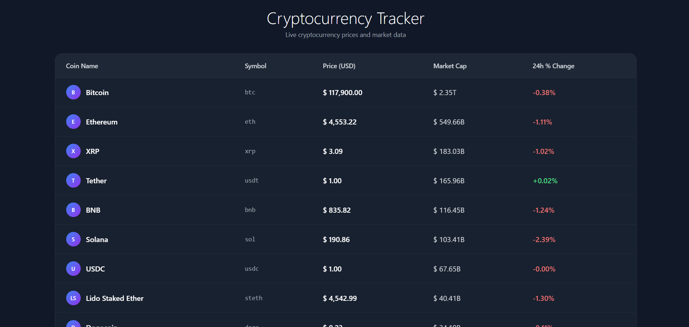
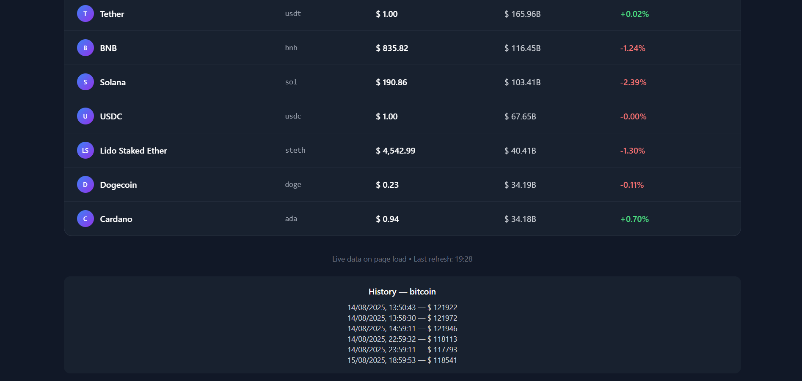
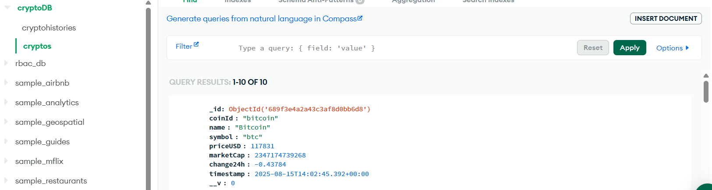
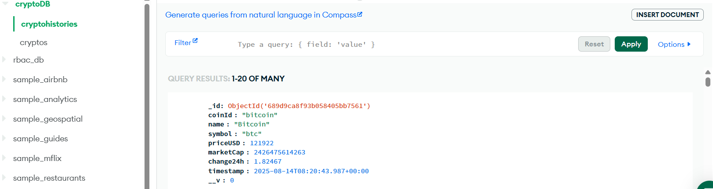
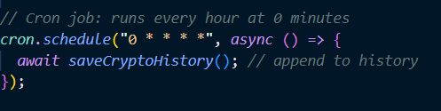

<div align="center" markdown="1">
	<h1>Crypto Tracker - Real-Time Market Tracker</h1>

**Live cryptocurrency dashboard with automated data sync — built with MERN stack**
</div>

<br>
<div align="center">
	
</div>
<br>
<div align="center">
    <a href="https://crypto-tracker-rosy-psi.vercel.app/" target="_blank">🌐 Frontend</a>
    <span> • </span>
    <a href="https://crypto-tracker-v6je.onrender.com" target="_blank">🔧 Backend</a>
</div>

## Crypto Tracker

Crypto Tracker is a full-stack cryptocurrency tracking application that provides real-time market data for the top 10 cryptocurrencies by market cap.  
Built with the **MERN stack** (MongoDB, Express.js, React, Node.js), it features automated data synchronization, historical tracking, and an intuitive dashboard.

## Motivation

Cryptocurrency markets move fast — this project was created to:
- Demonstrate **real-world full-stack development** with modern technologies
- Implement **automated data pipelines** with cron jobs
- Provide **clean visualization** of complex financial data
- Serve as a foundation for more advanced trading tools

## Key Features

- **Real-Time Crypto Dashboard**  
  Displays current prices, market caps, and 24h changes for top 10 cryptocurrencies

- **Automated Data Sync**  
  Scheduled cron jobs fetch fresh data from CoinGecko API every hour

- **Historical Tracking**  
  MongoDB stores timestamped snapshots for price trend analysis

- **Developer-Ready API**  
  RESTful backend with well-documented endpoints for future expansion

<details>
<summary>Preview</summary>




.

</details>

## Technical Stack

### Frontend
- **React.js** 
- **Tailwind CSS** 
- **Fetch API** 

### Backend
- Node.js 
- Express.js
- Mongoose

### Database
- MongoDB Atlas

### Automation
- node-cron for scheduled jobs

## Getting Started

### Installation

1. Clone the repository:

```
git clone https://github.com/siddharthkhati/crypto-tracker.git
cd crypto-tracker
```

2. BACKEND SETUP

```
cd backend

# Install dependencies
npm install

# Create .env file 
MONGO_URI=<your_mongo_uri>
PORT=5000

# Start backend in development mode (in background)
npm run dev
```

3. FRONTEND SETUP

```
cd ../frontend

# Install dependencies
npm install

# Start frontend
npm start
```